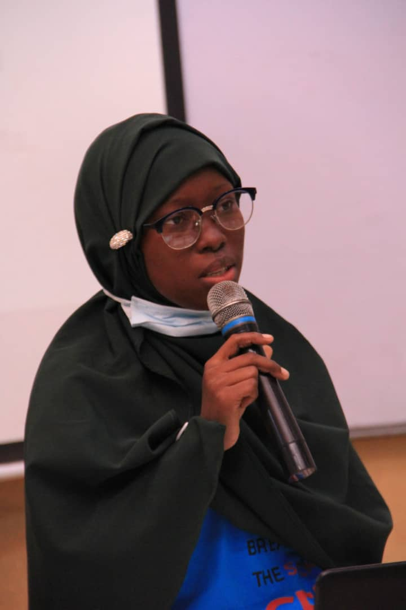

# Team-Crick
HackBio internship program is a 5-weeks virtual research internship that is practiced oriented and aimed at equipping scientists from different spheres of life 
with advanced bioinformatics and computational biology skills. The 5-weeks virtual internship program isn't just limited to research and computational biology, but individuals also get to participate in social activities and network with like-minds round the globe.
## Who we are
The team is named after a british molecular biologist Francis Crick known to have discovered the double helix structure of DNA. 

The team consists of 19 amazing people from different spheres of life who are currently undergoing a reaserch internship with HackBio aimed at equipping scientists from different spheres of life with advanced bioinformatics and computational skills
## Meet The Contributors

|  |   |
| ------- | ---------- |
|  | Ishaq-Balogun Anisa (Team lead)|
|  | Ahmadu, Maryam Abdulazeez |
|  |Adegite Adejuwon |
|  | Atanda Yinka |
|  | Sanniya Middha  |
|  | Ikechukwu Okoye |
|  | Samuel Adesanwo |
|  | Rachna |

We can't wait to showcase our big project

## Watch out this space...
